<!-- _class: lead -->
<!-- _paginate: false -->

# Big Data – Enjeux et Perspectives

---

## Sommaire

1. Introduction au Big Data
2. Enjeux Stratégiques et Métier
3. Architecture et Technologies du Big Data
4. Enjeux Organisationnels et Gouvernance
5. Big Data & Intelligence Artificielle
6. Perspectives et Tendances
7. Enjeux futurs et défis

</div>

---

<!-- _class: lead -->
<!-- _paginate: false -->

## Introduction au Big Data

---

## Introduction au Big Data

#### 1️⃣ Définition et les **5V du Big Data**

<br/>

<div style="font-size:39px">

- Le Big Data se définit par un ensemble de caractéristiques qui dépassent les capacités traditionnelles des systèmes d’information classiques. 
- Historiquement, on parle des **3V** (Volume, Vélocité, Variété), mais la définition a été enrichie à **5V** (et parfois même 7V, 10V dans certaines littératures).

</div>

---

## Introduction au Big Data

#### 1️⃣ Définition et les **5V du Big Data**

<div style="font-size:28px">

### 🔹 Les 5V en détail

1. **Volume**

   * Explosion de la quantité de données produites : données transactionnelles, logs systèmes, réseaux sociaux, IoT, capteurs, images, vidéos, données médicales…
   * On parle de **pétaoctets à exaoctets** (et même zettaoctets à l’échelle mondiale).
   * Exemple : Facebook génère plusieurs pétaoctets de données chaque jour ; les voitures autonomes produisent jusqu’à **4 To de données/jour/voiture**.
</div>


---

## Introduction au Big Data

#### 1️⃣ Définition et les **5V du Big Data**

<div style="font-size:32px">

### 🔹 Les 5V en détail

2. **Vélocité**

   * Capacité à traiter les données en **temps réel ou quasi temps réel**.
   * Flux continus (streaming) issus de capteurs IoT, transactions bancaires, interactions clients.
   * Exemple : détection de fraude bancaire doit se faire en **millisecondes**.

</div>


---

## Introduction au Big Data

#### 1️⃣ Définition et les **5V du Big Data**

<div style="font-size:30px">

### 🔹 Les 5V en détail

3. **Variété**

   * Multiplicité des formats :

     * Structurées (SQL, tableaux relationnels)
     * Semi-structurées (JSON, XML, logs, CSV)
     * Non structurées (vidéos, images, audio, mails, réseaux sociaux).
   * Plus de **80 % des données mondiales** sont **non structurées**.

</div>


---

## Introduction au Big Data

#### 1️⃣ Définition et les **5V du Big Data**

<div style="font-size:32px">

### 🔹 Les 5V en détail

4. **Véracité**

   * Fiabilité et qualité des données : données bruitées, incomplètes, biaisées.
   * Risques : fake news, données corrompues, erreurs de saisie.
   * Importance des techniques de **Data Cleaning, Data Governance, Data Lineage**.

</div>


---

## Introduction au Big Data

#### 1️⃣ Définition et les **5V du Big Data**

<div style="font-size:32px">

### 🔹 Les 5V en détail


5. **Valeur**

   * Le but du Big Data : **transformer la donnée en valeur ajoutée**.
   * Business value : optimiser coûts, améliorer l’expérience client, créer de nouveaux services, innover.
   * Exemple : Netflix utilise le Big Data pour personnaliser ses recommandations → valeur directe en fidélisation et revenus.

</div>


---

## Introduction au Big Data

#### 2️⃣ Historique : de l’entrepôt de données au Lakehouse

<div style="font-size:30px">

<br>

#### 🔹 **Années 1980 – 1990 : Data Warehouse (Entrepôt de données)**

* Vision : centraliser et consolider les données de l’entreprise pour le reporting et l’analyse décisionnelle.
* Architecture : ETL (Extract – Transform – Load) → Data Warehouse (schéma rigide) → Outils BI (Tableau, Business Objects, Cognos).
* Limite : données uniquement **structurées**, intégration lente, pas adapté aux données massives et variées.

</div>


---

## Introduction au Big Data

#### 2️⃣ Historique : de l’entrepôt de données au Lakehouse

<div style="font-size:30px">

<br>

### 🔹 **Années 2000 : Explosion du Web et des données**

* Web 2.0, réseaux sociaux, vidéos, e-commerce → croissance exponentielle.
* Google, Yahoo et Amazon développent de nouvelles approches (MapReduce, GFS, DynamoDB).
* Hadoop (2005-2008) popularise le stockage distribué et le traitement parallèle.

</div>


---

## Introduction au Big Data

#### 2️⃣ Historique : de l’entrepôt de données au Lakehouse

<div style="font-size:30px">

<br>

### 🔹 **Années 2010 : Data Lake**

* Concept introduit par James Dixon (CTO Pentaho).
* Stockage brut et massif de données **structurées, semi-structurées et non structurées** dans un même réservoir.
* Principe : **“Schema on Read”** (le schéma est appliqué au moment de la lecture et non de l’écriture).
* Avantage : flexibilité, coût faible avec le stockage objet (S3, Azure Blob, HDFS).
* Limite : risque de “**Data Swamp**” (marécage de données inutilisables faute de gouvernance).

</div>


---

## Introduction au Big Data

#### 2️⃣ Historique : de l’entrepôt de données au Lakehouse

<div style="font-size:29px">

### 🔹 **Années 2020 : Lakehouse**

* Fusion des avantages du **Data Warehouse** et du **Data Lake**.
* Supporte à la fois :

  * Données structurées (requêtes SQL, BI)
  * Données semi/non structurées (logs, JSON, multimédia)
* Exemple de technologies : **Delta Lake (Databricks)**, **Snowflake**, **Apache Iceberg**.
* Concept clé : **unifier BI + IA/ML** sur une même plateforme.

</div>

---

## Introduction au Big Data

#### 3️⃣ Comparaison : **Data Warehouse vs Data Lake vs Data Mesh**

<div style="font-size:31px">

### 🔹 **Data Warehouse (Entrepôt de données)**

* **Approche** : centralisée, structurée.
* **Schéma** : *Schema on Write* (schéma défini avant intégration).
* **Cas d’usage** : reporting, BI, analyses historiques.
* **Exemples** : Teradata, Oracle, SQL Server, SAP BW, Google BigQuery.
* **Limites** : coûteux, rigide, pas adapté aux données massives et non structurées.

</div>

---

## Introduction au Big Data

#### 3️⃣ Comparaison : **Data Warehouse vs Data Lake vs Data Mesh**

<div style="font-size:31px">

### 🔹 **Data Lake**

* **Approche** : stockage brut et massif.
* **Schéma** : *Schema on Read*.
* **Cas d’usage** : exploration, machine learning, IA, stockage universel.
* **Exemples** : Hadoop HDFS, AWS S3, Azure Data Lake Storage, GCP Cloud Storage.
* **Limites** : gouvernance difficile, risque de Data Swamp.

</div>

---

## Introduction au Big Data

#### 3️⃣ Comparaison : **Data Warehouse vs Data Lake vs Data Mesh**

<div style="font-size:31px">


<center>
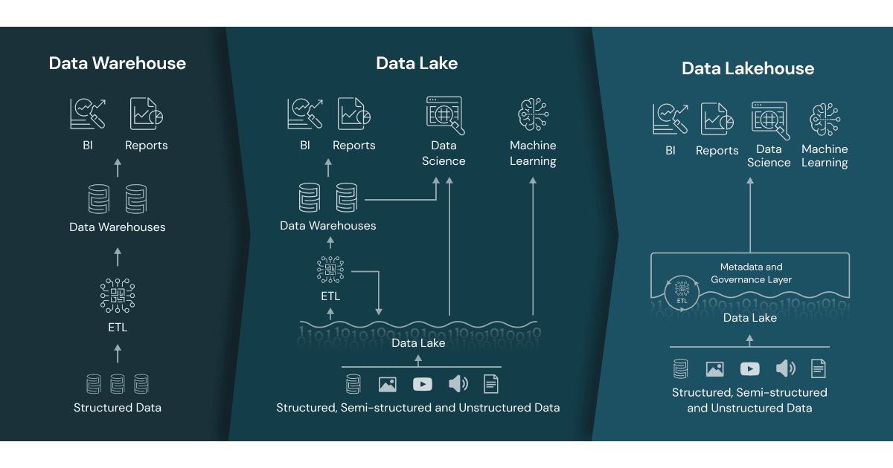
</center>

</div>

---

### Introduction au Big Data

##### 3️⃣ Comparaison : **Data Warehouse vs Data Lake vs Data Mesh**

<div style="font-size:20px">

### 🔹 **Data Mesh (nouvelle génération, années 2020)**

* **Approche** : décentralisée et orientée produit.
* Chaque domaine (marketing, finance, supply chain…) gère **sa propre donnée comme un produit**.
* S’appuie sur des **principes d’architecture distribuée** et des équipes multidisciplinaires.
* **Concepts clés** :

  * Domain-driven design appliqué à la donnée
  * Data as a Product
  * Self-serve data platform (plateformes en libre-service)
  * Gouvernance fédérée (politiques globales + autonomie locale).
* **Cas d’usage** : grandes organisations multi-domaines cherchant à éviter le “monolithe data”.
* **Exemples d’implémentation** : sur Databricks, Snowflake, Azure Synapse + outils de gouvernance type Collibra, Alation.
* **Avantage** : agilité, scalabilité organisationnelle.
* **Limite** : complexité culturelle et organisationnelle (nécessite maturité data des équipes).

</div>

---

### Introduction au Big Data

##### 3️⃣ Comparaison : **Data Warehouse vs Data Lake vs Data Mesh**

<div style="font-size:20px">


| Aspect               | Data Warehouse             | Data Lake                           | Data Mesh                           |
| -------------------- | -------------------------- | ----------------------------------- | ----------------------------------- |
| **Architecture**     | Centralisée                | Centralisée (stockage brut)         | Décentralisée (par domaine)         |
| **Schéma**           | Schema on Write            | Schema on Read                      | Variable (selon domaine)            |
| **Types de données** | Structurées                | Tous types (structurées, semi, non) | Tous types                          |
| **Cas d’usage**      | BI, reporting              | IA, ML, analyse exploratoire        | Gouvernance distribuée, scalabilité |
| **Exemples**         | Oracle, BigQuery, Redshift | Hadoop, S3, Azure Data Lake         | Snowflake + gouvernance distribuée  |
</div>

---


<!-- _class: lead -->
<!-- _paginate: false -->

## Enjeux Stratégiques et Métier

---

## Enjeux Stratégiques et Métier

#### Big Data est un levier stratégique (innovation, compétitivité, optimisation)

<div style="font-size:25px">

### 1) Trois leviers de valeur (cadre rapide à réutiliser)

* **Innovation (croissance)** : nouveaux produits & services data-driven, modèles économiques (data sharing/marketplaces), expériences augmentées (perso, temps réel), “platformisation”.
* **Compétitivité (différenciation)** : time-to-insight réduit, boucles d’apprentissage (A/B, bandits), effet réseau (plus d’utilisateurs = meilleure donnée = meilleur produit), barrières à l’entrée (coûts d’entraînement, données propriétaires).
* **Optimisation (efficience)** : automatisation analytique/IA, prévision & allocation d’actifs, qualité opérationnelle (OEE, SLA), réduction des risques & pertes (fraude, défauts), compliance by design.

</div>

---

## Enjeux Stratégiques et Métier

#### Big Data est un levier stratégique 

<div style="font-size:23px">

### 1) Trois leviers de valeur (cadre rapide à réutiliser)

#### Chaîne de valeur data (mémo)

**Ingestion → Stockage → Gouvernance → Traitements batch/stream → Feature store → Modèles/IA → Serving (API/BI) → Observabilité (DataOps/MLOps) → ROI/impact.**

#### Indicateurs d’impact (à suivre systématiquement)

* **Innovation** : % CA de nouveaux produits data, NPS/CES, conversion nouvelle offre, temps idée→MVP.
* **Compétitivité** : part de marché, coût d’acquisition (CAC), vitesse de déploiement (lead time), fréquence de release.
* **Optimisation** : coût unitaire, OEE, délai moyen (lead time), taux d’erreur/retour, MTBF/MTTR, pertes évitées.


</div>

---

## Enjeux Stratégiques et Métier

#### Big Data est un levier stratégique 

<div style="font-size:25px">

### 2) Secteurs impactés – modules “prêts à déployer”

### A. Santé (médecine personnalisée, génomique)

**Objectifs stratégiques**

* Passer du “moyen” au **personnalisé** (protocoles, dosage, suivi).
* **Prédire** les risques (sepsis, réadmission 30j), optimiser le **parcours patient**.
* Accélérer la **recherche clinique** (cohorte/éligibilité, RWE).

**Données & flux**

* Dossiers patients (EHR/EMR), HL7/FHIR, imagerie (DICOM), notes cliniques (NLP), **omiques** (génomique, transcriptomique), dispositifs connectés (IoMT), pharmacovigilance.
* Contraintes : **RGPD**, consentement, pseudonymisation, minimisation, traçabilité d’accès.

</div>

---

## Enjeux Stratégiques et Métier

#### Big Data est un levier stratégique 

<div style="font-size:25px">

### 2) Secteurs impactés – modules “prêts à déployer”

### A. Santé (médecine personnalisée, génomique)

**Cas d’usage phares**

* **Score de risque** (réadmission, sepsis) : modèles survie, gradient boosting, deep tabular.
* **NLP clinique** (extraction concepts SNOMED/ICD), **résumés** automatiques.
* **Imagerie** (détection lésions) : CNN/transformers.
* **Médecine personnalisée** : variants génétiques → protocole (règles + ML).
* **Planification hôpital** : prévisions lit/OR, optimisation bloc.

</div>

---

## Enjeux Stratégiques et Métier

#### Big Data est un levier stratégique 

<div style="font-size:25px">

### 2) Secteurs impactés – modules “prêts à déployer”

### A. Santé (médecine personnalisée, génomique)

**KPIs & ROI**

* -X% réadmissions, -X h délai diagnostic, +X% inclusion essais, conformité audit FHIR/consent.
* Architecture de référence : **ingestion FHIR + data lake chiffré + Delta/Iceberg + NLP/vision + MLOps (drift clinique)**.

**Risques & contrôles**

* Biais (population non représentée), explicabilité (SHAP/LIME), **fédéré** (FL) pour données sensibles, gouvernance d’accès clinicien/chercheur.
</div>

---

## Enjeux Stratégiques et Métier

#### Big Data est un levier stratégique 

<div style="font-size:25px">

### 2) Secteurs impactés – modules “prêts à déployer”

### B. Banque / Finance (fraude, scoring)

**Objectifs**

* **Réduire pertes** (fraude, défaut), **accélérer** on-boarding (KYC), **personnaliser** l’offre (next-best-action), respecter AML/PSD2/Bâle.

**Données**

* Transactions cartes & virement, KYC/CRS, logs canaux, open banking (API PSD2), graphes relations (comptes, bénéficiaires), données externes (bureaux de crédit).

</div>

---

## Enjeux Stratégiques et Métier

#### Big Data est un levier stratégique 

<div style="font-size:25px">

### 2) Secteurs impactés – modules “prêts à déployer”

### B. Banque / Finance (fraude, scoring)

**Cas d’usage**

* **Fraude temps réel** (streaming Kafka/Flink, features glissantes) + **graph analytics** (communautés/chemins).
* **Scoring crédit** (GBMs/autoML, fairness), **limites dynamiques**.
* **AML** (détection schémas, réseau), **priorisation alertes**.
* **Segmentation valeur/CLV**, **prix dynamique**.

</div>

---

## Enjeux Stratégiques et Métier

#### Big Data est un levier stratégique 

<div style="font-size:23px">

### 2) Secteurs impactés – modules “prêts à déployer”

### B. Banque / Finance (fraude, scoring)

**KPIs**

* Capture de fraude (recall) ↑, **false positives** ↓, délai décision carte < 50 ms, coût conformité ↓, temps KYC ↓.

**Architecture**

* **Event streaming** + feature store **on-line/off-line**, modèles servés en **low latency**, auditabilité (versioning jeux/poids), **explanations**.

**Risques**

* Biais discriminatoires (genre, origine), détournements adversariaux, gouvernance modèle (validation indépendante), régulation (EBA/ACPR).

</div>

---

## Enjeux Stratégiques et Métier

#### Big Data est un levier stratégique 

<div style="font-size:21px">

### 2) Secteurs impactés – modules “prêts à déployer”

#### C. Industrie 4.0 (IoT, maintenance prédictive)

**Objectifs**

* **OEE↑**, arrêts non planifiés ↓, **rendement matière** ↑, énergie ↓, fiabilité & sécurité.

**Données**

* Capteurs temps réel (vibration, température), SCADA/MES/ERP, **OPC-UA**, MQTT, logs qualité, vision (défauts).

**Cas d’usage**

* **Maintenance prédictive** (prognostics & health management) : séries temporelles, survival analysis, remaining useful life.
* **Détection défauts** (vision), **process mining**, **jumeau numérique** (digital twin).
* **Optimisation énergie** (prévision charge, arbitrage).

</div>

---

## Enjeux Stratégiques et Métier

#### Big Data est un levier stratégique 

<div style="font-size:25px">

### 2) Secteurs impactés – modules “prêts à déployer”

#### C. Industrie 4.0 (IoT, maintenance prédictive)

**KPIs**

* MTBF↑, MTTR↓, arrêts ↓, scrap ↓, consommation kWh/u ↓, TRS/OEE ↑.

**Architecture**

* **Edge computing** (prétraitement), bus temps réel, **data lake/lakehouse** industriel, MLOps avec surveillance **drift sensoriel**, boucle vers **MES/PLC**.

**Risques**

* Sécurité OT (segmentation réseau), intégration legacy, latence, cybersécurité (IEC 62443).

</div>

---

## Enjeux Stratégiques et Métier

#### Big Data est un levier stratégique 

<div style="font-size:22px">

### 2) Secteurs impactés – modules “prêts à déployer”

#### D. Smart Cities (trafic, énergie, urbanisme)

**Objectifs**

* Fluidité mobilité, **sobriété énergétique**, qualité de l’air, sécurité, services proactifs.

**Données**

* Boucles inductives, caméras (vision/edge), IoT environnement, smart meters, **open data**, mobile traces, météo.

**Cas d’usage**

* **Contrôle trafic** dynamique (coordination feux, prédiction flux).
* **Gestion énergie** (prévision consommation/production renouvelable, effacement).
* **Sécurité urbaine** (anomalies vidéo respect privacy).
* **Urbanisme** data-driven (jumeau numérique territoire).
</div>

---

## Enjeux Stratégiques et Métier

#### Big Data est un levier stratégique 

<div style="font-size:25px">

### 2) Secteurs impactés – modules “prêts à déployer”

#### D. Smart Cities (trafic, énergie, urbanisme)

**KPIs**

* Temps trajet ↓, émissions NOx/CO₂ ↓, pics énergie aplatis, satisfaction citoyens ↑.

**Architecture**

* **Edge + stream** (latence), data mesh inter-directions (mobilité/énergie/propreté), gouvernance éthique (privacy zone-based, floutage on-device).

**Risques**

* Vie privée/surveillance, dépendance fournisseurs, interopérabilité (standards, API publiques).

</div>

---


## Enjeux Stratégiques et Métier

#### Big Data est un levier stratégique 

<div style="font-size:25px">

### 2) Secteurs impactés – modules “prêts à déployer”

#### E. Retail & e-commerce (reco, personnalisation)

**Objectifs**

* **Conversion** ↑, panier moyen ↑, **stock** optimisé, churn ↓, marges ↑.

**Données**

* Clickstream, paniers, catalogue/attributs, CRM, campagnes, avis, logistique, prix concurrents.

</div>

---

## Enjeux Stratégiques et Métier

#### Big Data est un levier stratégique 

<div style="font-size:25px">

### 2) Secteurs impactés – modules “prêts à déployer”

#### E. Retail & e-commerce (reco, personnalisation)

**Cas d’usage**

* **Recommandations** (collaboratif, content-based, session-based, graph).
* **Personnalisation** omnicanale (ranking, bandits contextuels).
* **Forecast** demande (saisonnalité, promos), **prix dynamique**, **churn**.
* **Attribution** multicanale, **optimisation promo**.

**KPIs**

* CTR/CR ↑, AOV ↑, rupture ↓, démarque inconnue ↓, LTV/CAC ↑, uplift promo ↑.

</div>

---

## Enjeux Stratégiques et Métier

#### Big Data est un levier stratégique 

<div style="font-size:28px">

### 2) Secteurs impactés – modules “prêts à déployer”

#### E. Retail & e-commerce (reco, personnalisation)

**Architecture**

* Event streaming, **feature store**, moteurs de **ranking** online, A/B/n, MLOps (shadow/canary), BI temps réel.

**Risques**

* “Filter bubble”, fairness (exposition vendeurs), conformité cookies/consent, robustesse aux attaques (scraping, fraude avis).

</div>

---

## Enjeux Stratégiques et Métier

#### Big Data est un levier stratégique 

<div style="font-size:27px">

### 3) Modèles d’architecture réutilisables (templates)

**Pipeline générique “temps réel + batch”**

* **Ingestion** : Kafka/Flink (events), CDC/ELT (batch).
* **Stockage** : Data Lake(Lakehouse) + Warehouse (serving BI).
* **Traitement** : Spark/Flink + orchestrateur (Airflow/DBX).
* **Gouvernance** : catalogue (lineage, PII), politiques d’accès (ABAC).
* **ML** : feature store (off-line/on-line), registry modèles, MLOps (CI/CD, drift, canary).
* **Serving** : APIs faibles latences, dashboards, reverse ETL.
* **Observabilité** : test données (DQ), SLO pipelines, coût FinOps (tagging).

</div>

---

## Enjeux Stratégiques et Métier

#### Big Data est un levier stratégique 

<div style="font-size:27px">

### 4) Méthode d’identification & priorisation des cas d’usage (prête à l’emploi)

* **Backlog**: pour chaque idée → *Impact business* (€, KPI), *Faisabilité* (données, technique, change), *Dépendances*, *Risques* (juridiques/éthiques).
* **Scoring** (1–5) et matrice **Impact × Faisabilité** → quick wins (T0–T3 mois), core bets (T3–T12), explorations (>12).
* **Business case**: Bénéfices annuels – (Data/Cloud/Opex + Change) → **ROI** & **Payback**; définir **North Star Metric** et **leading indicators**.

</div>

---

## Enjeux Stratégiques et Métier

### Impact sur le métier du Chief Data Officer (CDO)

<div style="font-size:27px">

## 1) Mandat & périmètre

* **Vision & stratégie data** alignée aux OKR d’entreprise (offensive vs défensive).
* **Gouvernance** (comités, politiques PII/RGPD, qualité, access management).
* **Plateformes & outillage** (data platform, lakehouse, catalogue, MLOps, sécurité).
* **Data as a Product** : instaurer le **data mesh** (si pertinent), définir standards cross-domain.
* **Monétisation & partenariats** : data sharing, marketplaces, API produits.
* **Éthique & conformité** : privacy by design, fairness, auditabilité modèles.
</div>

---

## Enjeux Stratégiques et Métier

### Impact sur le métier du Chief Data Officer (CDO)

<div style="font-size:27px">

## 2) Operating model (organisation)

* **Hub & Spoke** : une équipe centrale (standards, plateforme, sécurité, MLOps) + équipes **domaines** (produits data).
* Rôles clés : **Data Product Owner**, Data Engineer, ML Engineer, Data Scientist, Analytics Engineer, Steward, Architecte Data/Sécu.
* **Compétences** : cloud/data, ML, produit, change management, finance/FinOps, juridique (RGPD/contrats).

</div>

---

## Enjeux Stratégiques et Métier

### Impact sur le métier du Chief Data Officer (CDO)

<div style="font-size:27px">

## 3) Cadre de gouvernance

* **Data Contracts** entre domaines, SLA/SLO (fraîcheur, complétude, disponibilité).
* **Catalogue & lineage** obligatoires (découvrabilité).
* **Qualité** : tests auto (Great Expectations/DBT tests), seuils d’alerte.
* **Sécurité** : classification PII/PHI, chiffrement, masquage dynamique, **least privilege**.
* **Modèles** : registre, validation indépendante, **model risk management**, traçabilité des features/versions.

</div>

---

## Enjeux Stratégiques et Métier

### Impact sur le métier du Chief Data Officer (CDO)

<div style="font-size:24px">

## 4) Feuille de route “100 jours” (exécutable)

1. **Semaine 1–2** : audit de maturité (données, équipes, outils, use-cases), cartographie sources/PII, risques.
2. **Sem. 3–4** : définir **North Star** + 5 KPIs d’entreprise; charte data; comité de gouvernance.
3. **Sem. 5–8** : cadrer 3 **quick wins** (1 par levier : innovation/compétitivité/optimisation) avec business case, data contract, plan MLOps.
4. **Sem. 9–12** : lancer plateforme minimale (ingestion, lakehouse, catalogue, CI/CD data), déployer **1 modèle** en production (pilot), mettre en place observabilité & coûts (FinOps).
5. **Livrables** : standard de nommage, modèles d’ABAC, modèle de data product, RACI & processus d’accès.

</div>

---

## Enjeux Stratégiques et Métier

### Impact sur le métier du Chief Data Officer (CDO)

<div style="font-size:24px">

## 5) KPIs du CDO (tableau de bord)

* **Adoption** : nb utilisateurs actifs (BI/DS), % domaines publiant des data products.
* **Time-to-Value** : délai idée→MVP, cycles A/B.
* **Qualité** : incidents DQ/mois, % datasets avec SLA respecté.
* **Économie** : coût/Go, coût par requête, waste cloud ↓, ROI use-cases.
* **Conformité** : audits réussis, temps de réponse aux demandes RGPD (AIPD, droit d’accès).
</div>

---

<!-- _class: lead -->
<!-- _paginate: false -->

## Architecture Big Data

---

## Architecture et Technologies du Big Data

### L’Architecture du Big Data

<div style="font-size:27px">

### 1️⃣ Principes fondamentaux

* **Scalabilité horizontale** : ajout de nœuds/serveurs standards plutôt que des machines très coûteuses.
* **Tolérance aux pannes** : réplication des données → disponibilité garantie.
* **Traitement distribué** : les calculs sont envoyés là où se trouvent les données.
* **Polyglot persistence** : utiliser différents types de bases selon les cas (SQL, NoSQL, graph, colonnes…).
* **Temps réel + batch** : combiner analyse historique et analyse instantanée.
</div>

---

### Architecture et Technologies du Big Data

#### L’Architecture du Big Data

<div style="font-size:20px">

## 2️⃣ Les différentes couches de l’architecture Big Data

### 🔹 1. Sources de données

* **Internes** : ERP, CRM, logs serveurs, transactions bancaires, données capteurs (IoT).
* **Externes** : open data, réseaux sociaux, données partenaires, APIs, web scraping.
* **Caractéristiques** : hétérogènes, massives, flux continu + historiques.

### 🔹 2. Ingestion des données

* Objectif : **collecter et transporter** les données vers le système central.
* **Technologies** :

  * **Batch** : ingestion périodique → Sqoop, Talend, Informatica.
  * **Streaming (temps réel)** : Kafka, Flume, NiFi, Pulsar.
* **Exemple** : Kafka collecte en temps réel des millions de clics d’utilisateurs sur un site e-commerce.

</div>

---
## Architecture et Technologies du Big Data

### L’Architecture du Big Data

<div style="font-size:25px">

### 2️⃣ Les différentes couches de l’architecture Big Data

### 🔹 3. Stockage distribué

* Objectif : stocker de manière fiable et scalable.
* **Data Lake** : stockage brut (S3, ADLS, HDFS, GCS).
* **Bases NoSQL** : MongoDB (documents), Cassandra (colonnes), Neo4j (graphes).
* **Formats optimisés** : Parquet, ORC, Avro (compacts, colonnes → rapides pour analyse).
* **Exemple** : un Data Lake S3 hébergeant vidéos, logs JSON, fichiers CSV et données IoT.

</div>

---

## Architecture et Technologies du Big Data

### L’Architecture du Big Data

<div style="font-size:25px">

### 2️⃣ Les différentes couches de l’architecture Big Data

### 🔹 4. Traitement des données

Deux modes complémentaires :

1. **Batch (traitement différé)**

   * Outils : Hadoop MapReduce, Spark.
   * Cas : analyses historiques, calculs lourds (fraude sur 1 an de transactions).

2. **Streaming (temps réel)**

   * Outils : Spark Streaming, Flink, Storm.
   * Cas : détection de fraude en direct, suivi trafic urbain, monitoring IoT.

</div>

---

## Architecture et Technologies du Big Data

### L’Architecture du Big Data

<div style="font-size:28px">

### 2️⃣ Les différentes couches de l’architecture Big Data

#### 🔹 5. Gouvernance, qualité et sécurité

* **Data Catalog** : Alation, Collibra (inventaire des données).
* **Qualité** : Data Cleaning, lineage (traçabilité).
* **Sécurité** : chiffrement, contrôle d’accès (Kerberos, Ranger), anonymisation (RGPD).
* **Exemple** : masque des données sensibles avant de les partager avec les équipes marketing.

</div>

---

## Architecture et Technologies du Big Data

### L’Architecture du Big Data

<div style="font-size:28px">

### 2️⃣ Les différentes couches de l’architecture Big Data

#### 🔹 6. Stockage analytique & requêtage

* **Entrepôts de données (Data Warehouse)** : Redshift, BigQuery, Synapse.
* **Data Lakehouse** : Delta Lake (Databricks), Snowflake, Iceberg.
* **Requêtage SQL massivement parallèle** : Presto, Trino, Hive.
* **Exemple** : analyste exécutant une requête SQL sur 10 ans de données clients (en quelques secondes via BigQuery).
</div>

---

## Architecture et Technologies du Big Data

### L’Architecture du Big Data

<div style="font-size:28px">

### 2️⃣ Les différentes couches de l’architecture Big Data

#### 🔹 7. Machine Learning & Intelligence Artificielle

* **Moteurs ML** : MLlib (Spark), TensorFlow, PyTorch, Scikit-Learn.
* **MLOps** : Kubeflow, MLflow pour industrialiser les modèles (monitoring, versionning).
* **Cas** : recommandation Netflix, maintenance prédictive, NLP pour assistants virtuels.

</div>

---

## Architecture et Technologies du Big Data

### L’Architecture du Big Data

<div style="font-size:28px">

### 2️⃣ Les différentes couches de l’architecture Big Data

#### 🔹 8. Restitution & visualisation

* **BI / Analytics** : Tableau, Power BI, Qlik Sense.
* **Dashboards temps réel** : Grafana, Kibana.
* **APIs** : exposer les données aux applications (REST/GraphQL).
* **Exemple** : tableau de bord affichant en temps réel le volume de commandes par région.

</div>

---


##### 3️⃣ Schéma global d’une architecture Big Data moderne

<br>
<center>
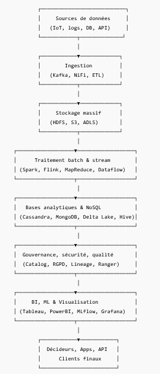
</center>

</div>

---

## Architecture et Technologies du Big Data

### L’Architecture du Big Data

<div style="font-size:30px">

##### 3️⃣ Schéma global d’une architecture Big Data moderne

<center>
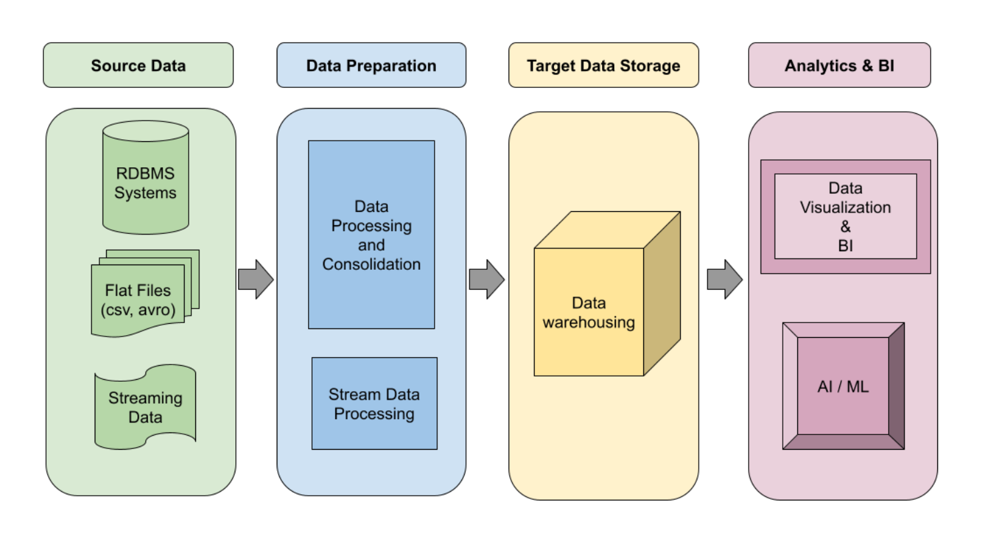
</center>

</div>

---

## Architecture et Technologies du Big Data

### L’Architecture du Big Data

<div style="font-size:30px">

<center>

</center>

</div>

---

## Architecture et Technologies du Big Data

### L’Architecture du Big Data

<br>

<div style="font-size:30px">

<center>
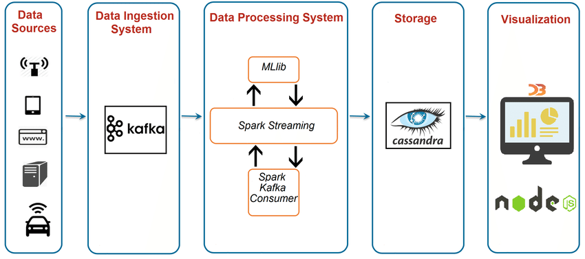
</center>

</div>

---

## Architecture et Technologies du Big Data

### L’Architecture du Big Data

<br>

<div style="font-size:30px">

<center>
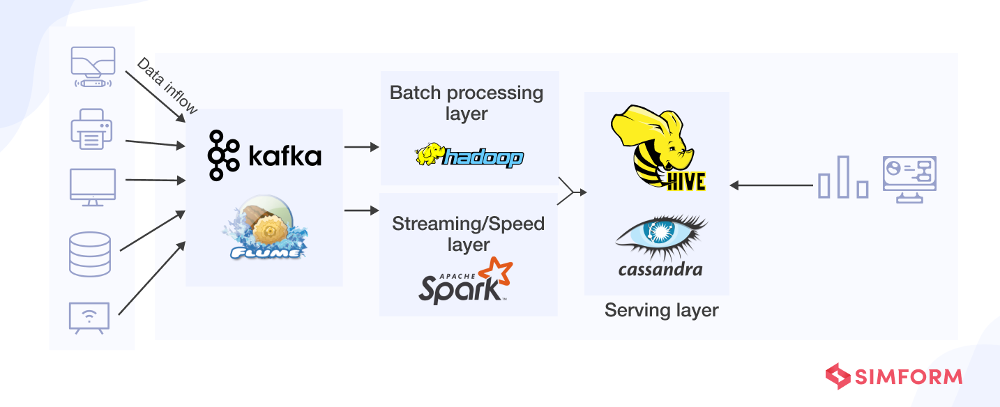
</center>

</div>

---


## Architecture et Technologies du Big Data

### L’Architecture du Big Data

<br>

<div style="font-size:30px">

<center>
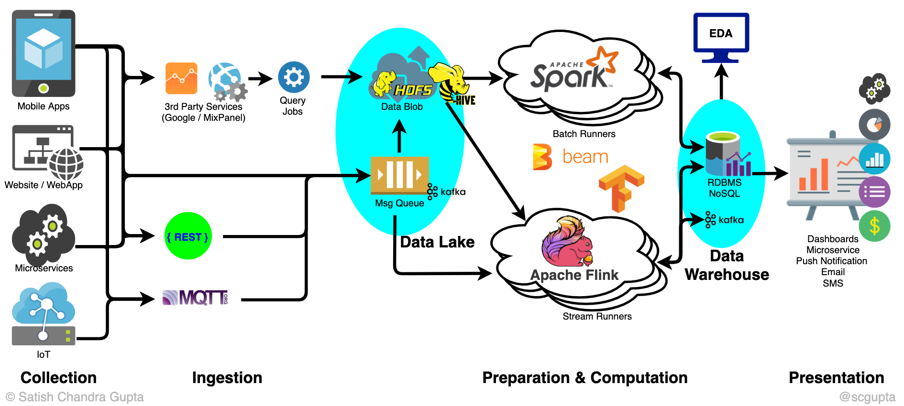
</center>

</div>

---

## Architecture et Technologies du Big Data

### L’Architecture du Big Data


<div style="font-size:30px">

<center>
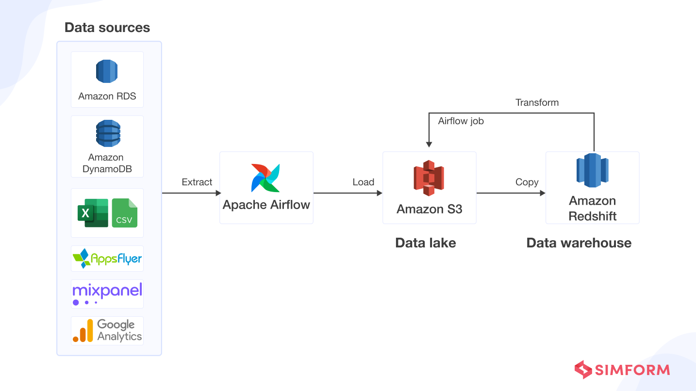
</center>

</div>

---

## Architecture et Technologies du Big Data

### L’Architecture du Big Data


<div style="font-size:30px">

<center>
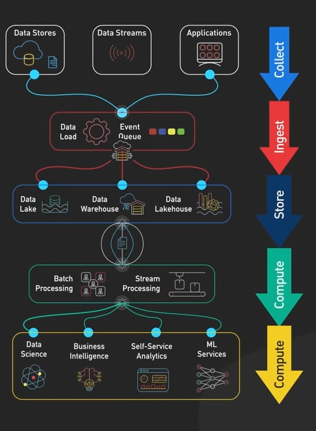
</center>

</div>

---

## Architecture et Technologies du Big Data

### L’Architecture du Big Data

<div style="font-size:30px">

#### 4️⃣ Évolutions de l’architecture Big Data

* **Hier :** Hadoop (stockage HDFS + batch MapReduce).
* **Aujourd’hui :** Spark/Flink + Kafka + Cloud Data Lakehouse.
* **Demain :** Data Mesh (données gérées comme des produits par domaines), Edge + 5G (traitement proche des sources), Quantum Big Data.

</div>

---

<!-- _class: lead -->
<!-- _paginate: false -->

## Technologies du Big Data

---

##  Technologies du Big Data


<div style="font-size:25px">

### 1️⃣ L’écosystème Hadoop : fondations historiques

Lancé au milieu des années 2000, **Hadoop** a révolutionné la manière de stocker et traiter les données massives distribuées. Il repose sur trois piliers principaux 

### 🔹 HDFS (Hadoop Distributed File System)

* **But** : stocker de très grands volumes de données sur des clusters de serveurs standards.
* **Concept** : chaque fichier est découpé en blocs (par défaut 128 Mo) et répliqué sur plusieurs nœuds (3 copies typiques).
* **Avantages** :

  * Tolérance aux pannes (un nœud qui tombe → données accessibles ailleurs).
  * Scalabilité horizontale (ajout de serveurs = plus de stockage).
* **Exemple** : stocker des pétaoctets de logs web répartis sur 100 serveurs.

</div>

---

##  Technologies du Big Data


<div style="font-size:25px">

<br>

<center>
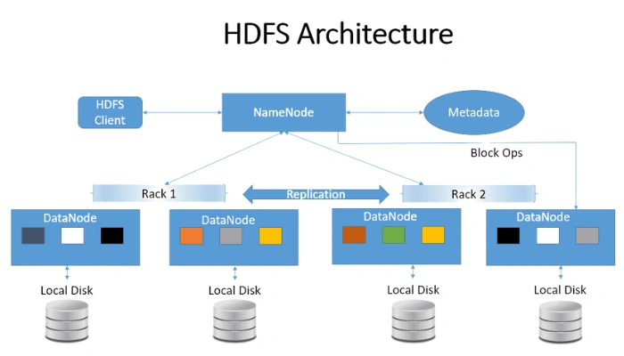
</center>


</div>

---

##  Technologies du Big Data


<div style="font-size:30px">

### 1️⃣ L’écosystème Hadoop : fondations historiques


### 🔹 YARN (Yet Another Resource Negotiator)

* **But** : gestionnaire de ressources du cluster Hadoop.
* **Fonction** : attribue CPU/RAM aux jobs soumis au cluster.
* **Analogie** : un “chef d’orchestre” qui décide quelle application tourne où et quand.
* **Exemple** : si plusieurs applications (Spark, MapReduce, Hive) tournent sur le même cluster, YARN alloue équitablement les ressources.

</div>

---

##  Technologies du Big Data


<div style="font-size:28px">

<center>
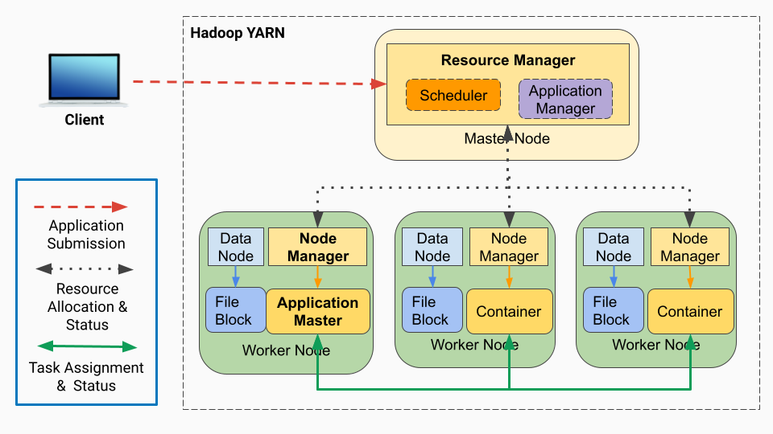
</center>

</div>

---

##  Technologies du Big Data


<div style="font-size:26px">

### 1️⃣ L’écosystème Hadoop : fondations historiques


### 🔹 MapReduce

* **Paradigme de calcul distribué** développé initialement par Google.
* **Deux étapes principales** :

  * **Map** : transformation des données (ex : extraire tous les mots d’un document).
  * **Reduce** : agrégation des résultats (ex : compter la fréquence de chaque mot).
* **Avantages** : traitement parallèle massif.
* **Limites** :

  * Lourd et lent (chaque étape nécessite d’écrire sur disque).
  * Moins adapté au **temps réel** → d’où l’émergence de Spark.
</div>

---

##  Technologies du Big Data


<div style="font-size:26px">


<center>
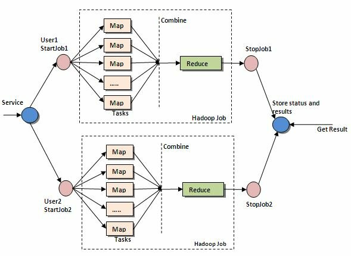
</center>
</div>

---

##  Technologies du Big Data


<div style="font-size:26px">

## 2️⃣ Traitement batch & streaming : Spark, Kafka, Flink

### 🔹 Apache Spark

* **Successeur de MapReduce** : beaucoup plus rapide (traitement en mémoire).
* **Modules** :

  * Spark SQL (requêtes SQL sur données massives).
  * MLlib (Machine Learning distribué).
  * GraphX (analyse de graphes).
  * Spark Streaming (flux temps réel “micro-batch”).
* **Exemple** : analyser en quelques secondes les logs de millions de clics pour comprendre le comportement utilisateur.

</div>

---

##  Technologies du Big Data


<div style="font-size:26px">


<center>
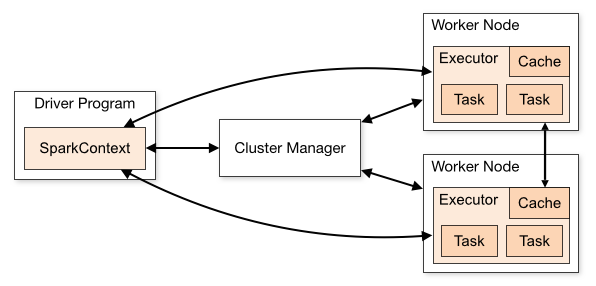
</center>

</div>

---

##  Technologies du Big Data


<div style="font-size:26px">

## 2️⃣ Traitement batch & streaming : Spark, Kafka, Flink

### 🔹 Apache Kafka

* **Plateforme de streaming distribué** (pub/sub).
* **Concept** : données → topics → consommateurs.
* **Cas d’usage** :

  * Collecter logs d’applications.
  * Streaming de transactions bancaires.
  * Systèmes d’alertes en temps réel.
* **Exemple** : Uber → Kafka collecte en temps réel la géolocalisation des chauffeurs et passagers.

</div>

---

##  Technologies du Big Data


<div style="font-size:26px">


<center>
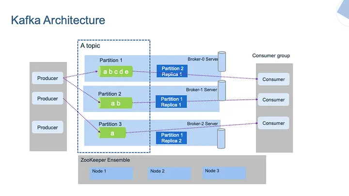
</center>

</div>

---

##  Technologies du Big Data


<div style="font-size:26px">

## 2️⃣ Traitement batch & streaming : Spark, Kafka, Flink

### 🔹 Apache Flink

* **Moteur de traitement temps réel natif (vs Spark micro-batch)**.
* **Points forts** :

  * Latence très faible (< 100 ms).
  * Fenêtres temporelles puissantes (sliding, tumbling).
  * Gestion avancée des états distribués.
* **Exemple** : analyse en temps réel des flux IoT (capteurs industriels, smart meters).

</div>

---

##  Technologies du Big Data


<div style="font-size:26px">

<br>

<center>
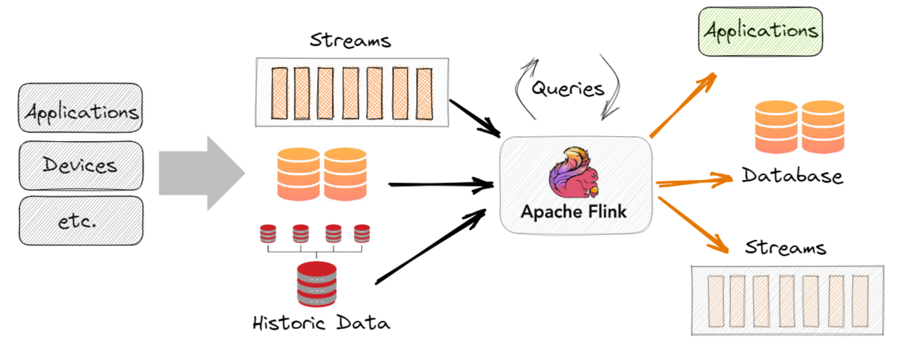
</center>

</div>

---

##  Technologies du Big Data


<div style="font-size:26px">

<br>

<center>
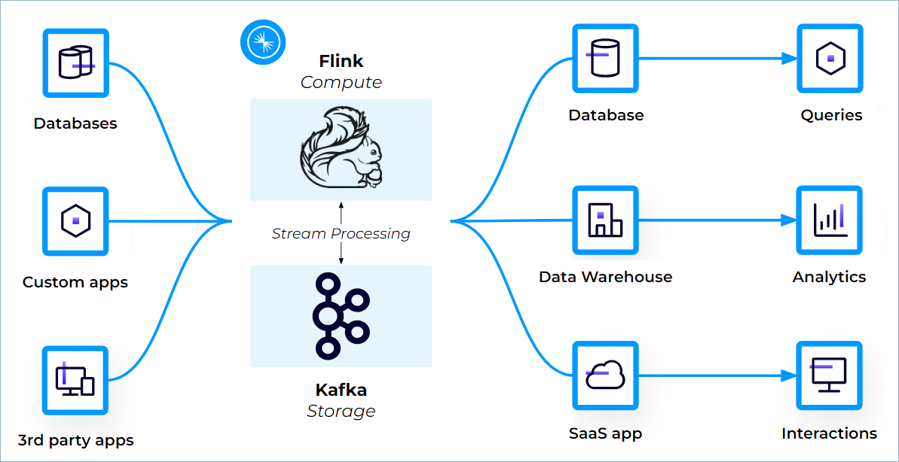
</center>

</div>

---

##  Technologies du Big Data


<div style="font-size:26px">

<br>

<center>
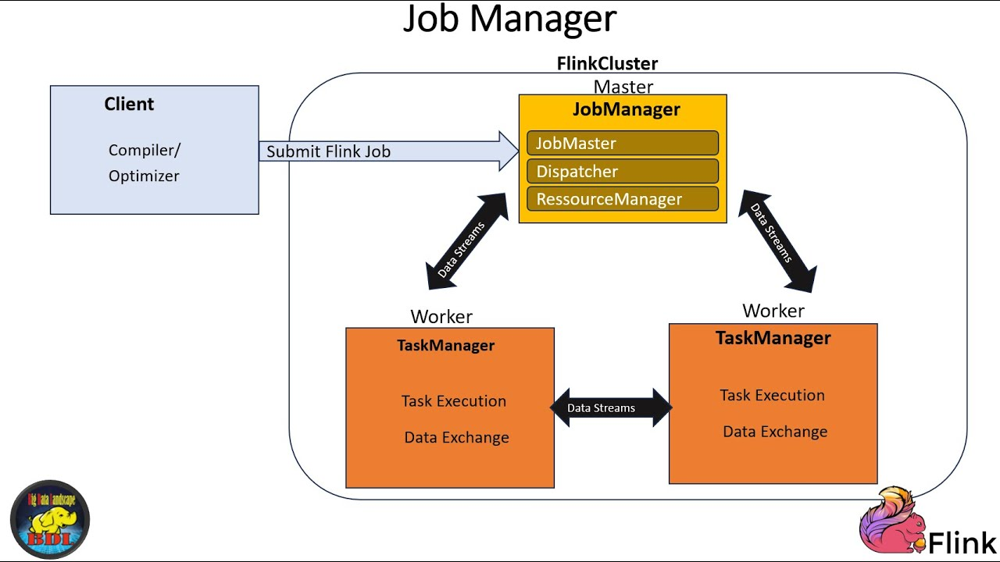
</center>

</div>

---

##  Technologies du Big Data

<div style="font-size:31px">

#### 3️⃣ Bases de données NoSQL : flexibilité et scalabilité

#### 🔹 Cassandra

* **Base orientée colonnes distribuée** (inspirée de BigTable de Google).
* **Forces** : haute disponibilité, tolérance aux pannes, scalabilité linéaire.
* **Exemple** : Netflix l’utilise pour gérer les données de visionnage de millions d’utilisateurs en temps réel.

</div>

---

##  Technologies du Big Data

<div style="font-size:20px">

## 3️⃣ Bases de données NoSQL : flexibilité et scalabilité

## 🔹 Cassandra

Cassandra suit une **architecture distribuée** **sans maître** :
Tous les nœuds d’un cluster sont **égaux** (architecture **peer-to-peer**).
Cela garantit :

* Pas de **single point of failure**.
* Une **réplication automatique**.
* Une **scalabilité horizontale** : on peut ajouter des nœuds facilement.

### **Composants clés** :

* **Cluster** → Ensemble de nœuds.
* **Nœud** → Serveur qui stocke une partie des données.
* **Keyspace** → "Base de données logique" qui définit la stratégie de réplication.
* **Table** → Stocke les lignes organisées par clés.
* **Partition** → Ensemble des lignes partageant une clé commune.


</div>

---

##  Technologies du Big Data

<div style="font-size:20px">

## 3️⃣ Bases de données NoSQL : flexibilité et scalabilité

## 🔹 Cassandra

Cassandra suit une **architecture distribuée** **sans maître** :
Tous les nœuds d’un cluster sont **égaux** (architecture **peer-to-peer**).
Cela garantit :

* Pas de **single point of failure**.
* Une **réplication automatique**.
* Une **scalabilité horizontale** : on peut ajouter des nœuds facilement.

### **Composants clés** :

* **Cluster** → Ensemble de nœuds.
* **Nœud** → Serveur qui stocke une partie des données.
* **Keyspace** → "Base de données logique" qui définit la stratégie de réplication.
* **Table** → Stocke les lignes organisées par clés.
* **Partition** → Ensemble des lignes partageant une clé commune.


</div>

---


##  Technologies du Big Data

<div style="font-size:25px">

## 3️⃣ Bases de données NoSQL : flexibilité et scalabilité

## 🔹 Cassandra

Cassandra est une **base NoSQL orientée colonnes distribuées**.
Elle a été conçue pour des besoins spécifiques :

* **Haute disponibilité**
* **Écriture massive**
* **Scalabilité horizontale**
* **Résilience multi-datacenter**

Contrairement à d’autres modèles, Cassandra **sacrifie la cohérence stricte** au profit de la **disponibilité** et de la **tolérance aux pannes** (principe **BASE** → *Basically Available, Soft state, Eventual consistency*).

</div>

---


##  Technologies du Big Data

<div style="font-size:28px">

## 3️⃣ Bases de données NoSQL : flexibilité et scalabilité

### 🔹 MongoDB

* **Base orientée documents (JSON/BSON)**.
* **Forces** :

  * Flexibilité du schéma.
  * Facile à utiliser pour applications modernes (APIs REST).
* **Exemple** : e-commerce (catalogue produits aux attributs variables).

</div>

---

##  Technologies du Big Data

<div style="font-size:28px">

## 3️⃣ Bases de données NoSQL : flexibilité et scalabilité

### 🔹 HBase

* **Base distribuée clé-colonne sur HDFS**.
* **Points forts** :

  * Intégrée à l’écosystème Hadoop.
  * Accès aléatoire rapide à de gros volumes.
* **Exemple** : Facebook l’a utilisée pour sa messagerie.

</div>

---

##  Technologies du Big Data

<div style="font-size:28px">

## 3️⃣ Bases de données NoSQL : flexibilité et scalabilité

### 🔹 HBase

* **Base distribuée clé-colonne sur HDFS**.
* **Points forts** :

  * Intégrée à l’écosystème Hadoop.
  * Accès aléatoire rapide à de gros volumes.
* **Exemple** : Facebook l’a utilisée pour sa messagerie.

</div>

---


##  Technologies du Big Data


| **Caractéristique**        | **Cassandra** *(NoSQL Colonnes)* | **SQL classique** *(MySQL, PostgreSQL)* | **MongoDB** *(Document NoSQL)* | **Redis** *(Clé-Valeur)* | **Neo4j** *(Graphes)*      |
| -------------------------- | -------------------------------- | --------------------------------------- | ------------------------------ | ------------------------ | -------------------------- |
| **Modèle**                 | Colonnes distribuées             | Relationnel                             | Documents JSON                 | Paires clé-valeur        | Graphes orientés           |
| **Schéma**                 | Flexible, colonnes dynamiques    | Rigide, nécessite migrations            | Flexible                       | Aucun                    | Flexible                   |
| **Scalabilité**            | **Horizontale native**           | Verticale (scaling limité)              | Horizontale                    | Horizontale              | Limitée                    |
| **Performance écriture**   | **Très élevée**                  | Bonne mais dépend des verrous           | Haute                          | **Excellente**           | Moyenne                    |


</div>

---


| **Caractéristique**        | **Cassandra** *(NoSQL Colonnes)* | **SQL classique** *(MySQL, PostgreSQL)* | **MongoDB** *(Document NoSQL)* | **Redis** *(Clé-Valeur)* | **Neo4j** *(Graphes)*      |
| -------------------------- | -------------------------------- | --------------------------------------- | ------------------------------ | ------------------------ | -------------------------- |
| **Performance lecture**    | Très bonne avec clé connue       | Très bonne                              | Excellente                     | Excellente               | Excellente                 |
| **Réplication multi-DC**   | **Native et simple**             | Complexe                                | Possible mais lourde           | Limitée                  | Faible                     |
| **Cohérence**              | **Éventuelle** configurable      | Forte (ACID)                            | Forte ou éventuelle            | Forte                    | Forte                      |
| **Cas d’usage**            | IoT, logs, transactions massives | ERP, CRM, BI                            | API Web, catalogues            | Cache, files d’attente   | Réseaux sociaux, relations |
| **Exemples d’entreprises** | Netflix, Uber, Instagram         | Banque, e-commerce, ERP                 | eBay, Expedia, Lyft            | Twitter, GitHub          | LinkedIn, Facebook         |


</div>

---

##  Technologies du Big Data

<div style="font-size:28px">

## 4️⃣ Cloud & Big Data : démocratisation à grande échelle

### 🔹 AWS

* **EMR (Elastic MapReduce)** : Hadoop/Spark/Kafka managés.
* **Redshift** : entrepôt de données massives.
* **S3** : stockage objet massivement scalable (souvent utilisé comme Data Lake).

### 🔹 Azure

* **Azure Synapse Analytics** : Data Warehouse cloud.
* **Azure Databricks** : traitement big data & IA (Spark managé).
* **Data Lake Storage** : stockage distribué basé sur Blob.


</div>

---

##  Technologies du Big Data

<div style="font-size:30px">

## 4️⃣ Cloud & Big Data : démocratisation à grande échelle

### 🔹 GCP

* **BigQuery** : entrepôt de données serverless, très rapide (SQL sur pétaoctets).
* **Dataflow** : traitement batch & stream (Apache Beam managé).
* **Cloud Storage** : stockage distribué.

👉 **Avantage Cloud** : services managés → plus besoin d’administrer le cluster, pay-as-you-go, élasticité automatique.


</div>

---

##  Technologies du Big Data

<div style="font-size:30px">

## 5️⃣ Modern Data Stack : vers le Data Lakehouse

### 🔹 Data Lakehouse

* **Fusion du Data Lake (souplesse)** + **Data Warehouse (performance et gouvernance)**.
* Permet à la fois :

  * Stockage de tous types de données (structurées + non structurées).
  * Requêtes SQL rapides pour la BI.
  * Support natif pour ML/IA.

</div>

---

##  Technologies du Big Data

<div style="font-size:26px">

## 5️⃣ Modern Data Stack : vers le Data Lakehouse

### 🔹 Delta Lake

* Développé par **Databricks**.
* Ajoute une **couche transactionnelle ACID** au Data Lake.
* **Fonctionnalités** :

  * Historisation (time travel).
  * Gestion de la qualité des données (schema enforcement).
  * Meilleure intégration Spark.
* **Exemple** : banques utilisant Delta Lake pour auditer toutes les transactions avec garanties ACID.

</div>

---

##  Technologies du Big Data

<div style="font-size:27px">

## 5️⃣ Modern Data Stack : vers le Data Lakehouse

### 🔹 Snowflake

* **Entrepôt de données cloud-native** (multi-cloud : AWS, Azure, GCP).
* **Points forts** :

  * Décorrélation stockage / calcul (scalabilité indépendante).
  * Concurrence massive (plusieurs équipes requêtent en parallèle sans ralentissement).
  * Partage sécurisé de données (“Data Sharing”).
* **Exemple** : une entreprise SaaS qui partage ses données analytiques avec ses clients en temps réel.

</div>

---


<!-- _class: lead -->
<!-- _paginate: false -->

## Enjeux Organisationnels et Gouvernance du Big Data

---

###  Enjeux Organisationnels et Gouvernance du Big Data

<div style="font-size:24px">

## 1️⃣ Organisation autour de la donnée

### 🔹 Le **Data Office**

* **Mission** : piloter la stratégie data de l’entreprise, définir les règles de gouvernance, assurer la conformité et maximiser la valeur métier.
* **Composition typique** :

  * **Chief Data Officer (CDO)** : définit la stratégie globale et reporte souvent au DG ou DSI.
  * **Data Governance Lead** : met en place politiques & processus de gouvernance.
  * **Data Steward** : responsable qualité & documentation des données dans un domaine spécifique.
  * **Data Architect** : conçoit les architectures data (lakes, warehouses, pipelines).

</div>

---
###  Enjeux Organisationnels et Gouvernance du Big Data

<div style="font-size:19px">

## 1️⃣ Organisation autour de la donnée

### 🔹 Les rôles clés opérationnels

1. **Data Engineer**

   * Conçoit et maintient les pipelines de données (ETL/ELT, ingestion Kafka, jobs Spark).
   * Gère la performance, la scalabilité, la disponibilité.
   * Exemple : mettre en place un pipeline Kafka → S3 → Delta Lake.

2. **Data Scientist**

   * Exploite les données pour créer des modèles prédictifs et d’IA (ML, deep learning).
   * Exemple : développer un modèle de prédiction de churn clients.

3. **Data Analyst**

   * Transforme les données en insights via SQL, visualisation (Tableau, PowerBI).
   * Exemple : créer un tableau de bord des ventes par région et canal.

</div>

---

###  Enjeux Organisationnels et Gouvernance du Big Data

<div style="font-size:27px">

## 2️⃣ Gouvernance et qualité de la donnée

### 🔹 Gouvernance des données

* **Objectifs** :

  * Garantir **fiabilité, accessibilité et sécurité** des données.
  * Définir **qui peut faire quoi** avec les données.
  * Harmoniser les définitions métiers (ex. “client actif”).
* **Cadres et référentiels** : DAMA-DMBOK, DCAM, ISO/IEC 38505.

</div>

---


###  Enjeux Organisationnels et Gouvernance du Big Data

<div style="font-size:27px">

## 2️⃣ Gouvernance et qualité de la donnée

### 🔹 Qualité de la donnée

* Dimensions clés :

  * **Exactitude** : données correctes (ex. code postal valide).
  * **Complétude** : absence de valeurs manquantes critiques.
  * **Cohérence** : alignement entre systèmes (même client = même ID partout).
  * **Fraîcheur (timeliness)** : actualité des données (données de stock < 1h).
* Outils : **Great Expectations, Deequ, Talend DQ**.

</div>

---

###  Enjeux Organisationnels et Gouvernance du Big Data

<div style="font-size:30px">

## 2️⃣ Gouvernance et qualité de la donnée

### 🔹 Data Catalog

* **But** : inventaire des données disponibles dans l’entreprise.
* Fonctionnalités : recherche, métadonnées, classification (PII/PHI), accès.
* Outils : Collibra, Alation, AWS Glue Data Catalog.

</div>

---

###  Enjeux Organisationnels et Gouvernance du Big Data

<div style="font-size:30px">

## 2️⃣ Gouvernance et qualité de la donnée

### 🔹 Data Lineage

* **Traçabilité des données** : savoir d’où elles viennent, quelles transformations elles ont subies, où elles sont utilisées.
* Exemple : un indicateur financier calculé à partir de données clients doit être traçable jusqu’aux systèmes sources.
* Outils : Apache Atlas, OpenLineage.

</div>

---


###  Enjeux Organisationnels et Gouvernance du Big Data

<div style="font-size:28px">

## 2️⃣ Gouvernance et qualité de la donnée

### 🔹 MDM (Master Data Management)

* Vise à créer une **“golden record”** unique pour chaque entité clé (client, produit, fournisseur).
* Évite les doublons et incohérences (un même client = 5 entrées différentes dans différents systèmes).
* Exemple : banque qui doit avoir une vision unique d’un client pour gérer son risque global.

</div>

---

###  Enjeux Organisationnels et Gouvernance du Big Data

<div style="font-size:26px">

## 3️⃣ Sécurité & conformité

### 🔹 RGPD (Règlement Général sur la Protection des Données)

* Principes :

  * Consentement explicite.
  * Minimisation des données.
  * Droit d’accès, rectification, effacement (“droit à l’oubli”).
  * Privacy by design & by default.
* Exemple : un site e-commerce doit permettre à un client de demander l’effacement complet de ses données personnelles.

</div>

---

###  Enjeux Organisationnels et Gouvernance du Big Data

<div style="font-size:26px">

## 3️⃣ Sécurité & conformité

### 🔹 Data Sovereignty (souveraineté des données)

* Les données doivent rester **dans la juridiction du pays** où elles sont produites.
* Exemple : certaines données de santé en France doivent être hébergées dans un HDS (Hébergeur de Données de Santé) agréé.
* Contrainte forte pour les multinationales utilisant le Cloud (AWS, Azure, GCP).

</div>

---

###  Enjeux Organisationnels et Gouvernance du Big Data

<div style="font-size:26px">

## 3️⃣ Sécurité & conformité

### 🔹 Techniques d’anonymisation et pseudonymisation

* **Anonymisation** : transformation irréversible (ex. suppression d’ID, agrégation).
* **Pseudonymisation** : remplacement par un identifiant artificiel, mais ré-identifiable via clé sécurisée.
* Exemple :

  * Études médicales → anonymisation totale.
  * Bases clients → pseudonymisation pour permettre analyses marketing.

</div>

---

###  Enjeux Organisationnels et Gouvernance du Big Data

<div style="font-size:21px">

## 4️⃣ Dilemmes éthiques

### 🔹 Biais algorithmiques

* Problème : modèles d’IA reproduisent (ou amplifient) les biais présents dans les données d’entraînement.
* Exemples :

  * Algorithmes de recrutement discriminant les femmes car entraînés sur des CV majoritairement masculins.
  * Modèle de scoring de crédit défavorisant certaines zones géographiques.
* Solutions :

  * Audits réguliers.
  * Métriques de fairness (disparate impact, equalized odds).
  * Jeux de données diversifiés.

</div>

---

###  Enjeux Organisationnels et Gouvernance du Big Data

<div style="font-size:20px">

## 4️⃣ Dilemmes éthiques

### 🔹 Surveillance et vie privée

* Collecte massive de données = risque de dérive vers la surveillance intrusive.
* Exemple : caméras de reconnaissance faciale dans l’espace public.
* Question éthique : sécurité vs libertés individuelles.

### 🔹 Confiance numérique

* Si les utilisateurs n’ont pas confiance, ils ne partagent pas leurs données.
* Exemples :

  * Scandale Cambridge Analytica → perte de confiance envers Facebook.
  * Banques mettant en avant la transparence pour rassurer clients (open banking).
* **Objectif clé** : créer un cadre de **transparence, explicabilité et contrôle utilisateur**.

</div>

---

####  Enjeux Organisationnels et Gouvernance du Big Data

<div style="font-size:20px">

<br>
<center>
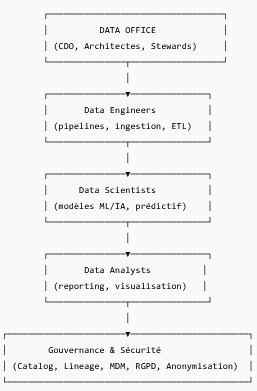
</center>

</div>

---

###  Enjeux Organisationnels et Gouvernance du Big Data

<div style="font-size:20px">

## 4️⃣ Dilemmes éthiques

### 🔹 Surveillance et vie privée

* Collecte massive de données = risque de dérive vers la surveillance intrusive.
* Exemple : caméras de reconnaissance faciale dans l’espace public.
* Question éthique : sécurité vs libertés individuelles.

### 🔹 Confiance numérique

* Si les utilisateurs n’ont pas confiance, ils ne partagent pas leurs données.
* Exemples :

  * Scandale Cambridge Analytica → perte de confiance envers Facebook.
  * Banques mettant en avant la transparence pour rassurer clients (open banking).
* **Objectif clé** : créer un cadre de **transparence, explicabilité et contrôle utilisateur**.

</div>


---

<!-- _class: lead -->
<!-- _paginate: false -->

## Big Data & Intelligence Artificielle

---

###  Big Data & Intelligence Artificielle

<div style="font-size:24px">

## 1) Le lien Big Data → Machine Learning → Deep Learning

### a) Chaîne de valeur (de la donnée au modèle en prod)

**Collecte → Stockage → Préparation → Features → Entraînement → Évaluation → Déploiement → Observabilité → Boucles de feedback.**

* **Big Data** = capacités **volume/vitesse/variété** (lakes, streams, NoSQL) pour **nourrir** les modèles.
* **Machine Learning (ML)** = algos apprenants (GBM, régressions, arbres, SVM…) efficaces avec **features conçues** par des humains.
* **Deep Learning (DL)** = réseaux profonds (CNN, RNN, Transformers) apprenant **représentations** depuis des données massives; devient **state-of-the-art** quand on a **beaucoup de données** + compute.

</div>


---

### Big Data & Intelligence Artificielle

<div style="font-size:30px">

## 1) Le lien Big Data → Machine Learning → Deep Learning

### b) Quand choisir quoi ?

* **Peu de données / forte explicabilité** → ML “classique” (XGBoost, GLM).
* **Données massives hétérogènes (texte, image, audio)** → DL (Transformers, CNN).
* **Temps réel faible latence** → modèles compacts/quantifiés, ou **inférence sur edge**.


</div>


---


### Big Data & Intelligence Artificielle

<div style="font-size:26px">

## 1) Le lien Big Data → Machine Learning → Deep Learning

### c) Architecture type “data→IA”

```
Sources (apps, IoT, logs, DB, web)
      │
Ingestion (Kafka/NiFi/CDC) ──► Data Lake/Lakehouse (S3/ADLS + Delta/Iceberg)
      │                                       │
      ├─► Préparation & Features (Spark/Flink + Feature Store: Feast/Tecton)
      │                                       │
      └─► Entraînement (Databricks/Ray/Vertex/AzureML) + Registry (MLflow)
                                              │
                                  Déploiement (REST/gRPC, Batch scoring, Stream)
                                              │
                                  Observabilité (drift, qualité, coûts, sécurité)
```
</div>


---

### Big Data & Intelligence Artificielle

<div style="font-size:26px">

## 2) La donnée = carburant de l’IA

### a) Qualité > Quantité (mais la quantité aide)

* **Signal utile** > bruit: déduplication, normalisation, nettoyage, **data contracts**.
* **Balance classes / fairness**: ré-échantillonnage, poids de classe, audits de biais.
* **Labels**: or/argent/bronze (humain, heuristique, distant), **guides d’annotation**.

### b) Ingénierie des données

* **Schemas stables** (Avro/Protobuf + registry), **pii tagging** (PII/PHI).
* **Formats colonnes** (Parquet/ORC), **partitions** (date, clé métier).
* **Feature Store**: cohérence **offline/online**, historique (time-travel), réutilisation.

</div>


---

### Big Data & Intelligence Artificielle

<div style="font-size:28px">

## 2) La donnée = carburant de l’IA

<br>

### c) Data-centric AI (pratiques)

* **Augmentation** (texte: back-translation; image: flips/crops; audio: time-shift).
* **Synthétique** (diffusion/LLM) **étiquetée** + contrôlée par **tests de fuite** (éviter la mémorisation PII).
* **Évaluation continue**: set d’épreuves vivantes (bench “canari” par cas d’usage).


</div>


---

### Big Data & Intelligence Artificielle

<div style="font-size:23px">

### 3) Exemples concrets

#### 3.1 Chatbots intelligents (NLP)

#### a) Objectifs

* **SAV / self-service** (réduction contacts), **productivité** agents, **vente assistée** (reco, cross-sell).

#### b) Pipeline (RAG + outils)

```
Documents (FAQ, contrats, emails, KB, sites)
      │
Ingestion & chunking (200–800 tokens, overlap)
      │
Nettoyage + PII redaction + enrichissement (métadonnées)
      │
Embeddings (e.g., bge/all-mpnet) → Vector DB (FAISS/PGVector/Weaviate)
      │
► Chat runtime:
User prompt ─→ Retrieval top-k ─→ Context builder ─→ LLM (génération)
                              │
                        Outils (fonction appel: CRM, commandes, paiements)
```

</div>


---


### Big Data & Intelligence Artificielle

<div style="font-size:22px">

### 3) Exemples concrets

#### 3.1 Chatbots intelligents (NLP)

#### c) Points clés “Big Data”

* **Indexation massive** (millions de chunks), **MàJ incrémentales** (CDC).
* **Diversité** des sources (PDF/HTML/Docx/CSV) → **normalisation** (unifier).
* **Observabilité du RAG**: taux de **réponses sourcées**, **hallucination rate**, **coverage** des requêtes.

#### d) Métriques

* **Task Success Rate** / **First Contact Resolution**.
* **Faithfulness** (réponses appuyées par documents), **Context Recall/Precision**.
* **Temps de réponse P95**, **coût / session**, **CSAT/NPS**.

#### e) Garde-fous & conformité

* **Filtrage PII**, **journaux** (audit), **RBAC/ABAC** (context par utilisateur).
* **Toxicité/risques** (modérateurs), **logger** prompts/outputs pour **ré-entrainer**.

</div>


---

### Big Data & Intelligence Artificielle

<div style="font-size:22px">

### 3) Exemples concrets

#### 3.1 Chatbots intelligents (NLP)

#### c) Points clés “Big Data”

* **Indexation massive** (millions de chunks), **MàJ incrémentales** (CDC).
* **Diversité** des sources (PDF/HTML/Docx/CSV) → **normalisation** (unifier).
* **Observabilité du RAG**: taux de **réponses sourcées**, **hallucination rate**, **coverage** des requêtes.

#### d) Métriques

* **Task Success Rate** / **First Contact Resolution**.
* **Faithfulness** (réponses appuyées par documents), **Context Recall/Precision**.
* **Temps de réponse P95**, **coût / session**, **CSAT/NPS**.

#### e) Garde-fous & conformité

* **Filtrage PII**, **journaux** (audit), **RBAC/ABAC** (context par utilisateur).
* **Toxicité/risques** (modérateurs), **logger** prompts/outputs pour **ré-entrainer**.

</div>


---

### Big Data & Intelligence Artificielle

<div style="font-size:22px">

### 3) Exemples concrets

### 3.2 Vision par ordinateur (reconnaissance d’image massive)

#### a) Cas d’usage

* **Inspection qualité** (industrie), **retail** (détection rayons), **santé** (imagerie), **sécurité** (intrusion).

#### b) Pipeline

```
Capture (caméras/edge) → Buffer stream (RTSP/Kinesis) → Data Lake (frames/clips)
       │                          │
       │                          └─► Labeling (CVAT/Labelbox, guidelines stricts)
       │
Prétraitement (resize, normalisation, augmentations)
       │
Modèle (CNN/ViT/YOLO/Mask R-CNN) → Entraînement distribué (Horovod/DeepSpeed/Ray)
       │
Compression (quantization, pruning, distillation)
       │
Déploiement (edge GPU/CPU, Triton) + Monitoring (fps, mAP, drift)
```

</div>


---

### Big Data & Intelligence Artificielle

<div style="font-size:25px">

### 3) Exemples concrets

### 3.2 Vision par ordinateur (reconnaissance d’image massive)

#### c) Big Data angle

* **Grand-échelle**: millions d’images/vidéos (stockage objet, lifecycle policies).
* **Versionnage datasets** (DVC/LakeFS), **équilibre classes** (hard negatives mining).
* **Edge**: **pré-filtrage** (détecter & découper ROIs) pour réduire coût.

#### d) Métriques

* **mAP**, **IoU**, **Recall/Precision**, **latence** par image, **FPS**.
* **Taux faux positifs** (coût opérationnel), **drift** (lumière, caméras neuves).

</div>


---


### Big Data & Intelligence Artificielle

<div style="font-size:25px">

### 3) Exemples concrets

### 3.3 IA générative (modèles de langage, multimodalité)

#### a) Cas d’usage

* **Contenu marketing** (adapté au ton/brand), **résumés** docs, **assistants code**, **Q\&R contractuelle**, **génération d’images/vidéo**.

#### b) Modèles & approches

* **LLM** (texte-→texte), **VLM** (image+texte), **Diffusion** (image/audio/vidéo).
* **Stratégies** :

  * **RAG** (retrieval-augmented), **fine-tuning léger** (LoRA/Adapters) sur données métiers,
  * **Tool use** (functions), **agents** (planification, outils multiples).

</div>


---

### Big Data & Intelligence Artificielle

<div style="font-size:28px">

### 3) Exemples concrets

### 3.3 IA générative (modèles de langage, multimodalité)

#### c) Flux data & gouvernance

* **Corpus d’entraînement** curaté (déduplication, filtrage toxicité, licences).
* **PII/PHI**: hash/masquage + **tests de ré-identification**.
* **Évals**: factualité (closed-book QA), **exactitude** (rouge/bleu en résumé structuré), **préférence humaine** (win-rate), **sécurité** (jailbreak tests).

</div>


---

### Big Data & Intelligence Artificielle

<div style="font-size:28px">

### 3) Exemples concrets

### 3.3 IA générative (modèles de langage, multimodalité)

#### c) Flux data & gouvernance

* **Corpus d’entraînement** curaté (déduplication, filtrage toxicité, licences).
* **PII/PHI**: hash/masquage + **tests de ré-identification**.
* **Évals**: factualité (closed-book QA), **exactitude** (rouge/bleu en résumé structuré), **préférence humaine** (win-rate), **sécurité** (jailbreak tests).

</div>


---

### Big Data & Intelligence Artificielle

<div style="font-size:23px">

### 3) Exemples concrets

### 3.3 IA générative (modèles de langage, multimodalité)

#### c) Flux data & gouvernance

* **Corpus d’entraînement** curaté (déduplication, filtrage toxicité, licences).
* **PII/PHI**: hash/masquage + **tests de ré-identification**.
* **Évals**: factualité (closed-book QA), **exactitude** (rouge/bleu en résumé structuré), **préférence humaine** (win-rate), **sécurité** (jailbreak tests).

#### d) Coûts & perf

* **Training**: distribué (FSDP/ZeRO/DeepSpeed), mix de précision (bf16/fp8), **checkpointing**.
* **Inférence**: **quantization** (8/4 bits), **KV cache**, **speculative decoding**, **distillation**, batching dynamique.
* **FinOps**: tracer **€/1k tokens**, **€/réponse**, auto-scale, cache sémantique.


</div>


---

### Big Data & Intelligence Artificielle

<div style="font-size:23px">

### 4) MLOps / LLMOps (industrialisation)

### a) Invariants

* **Registry** (MLflow) : modèles, versions, signatures.
* **CI/CD**: tests data (Great Expectations), tests perf (latence/throughput), tests sécurité (PII leak).
* **Canary/Shadow**: tester sur trafic miroir, rollback instantané.
* **Monitoring**: **drift** (population, concept), **quality** (AUC/mAP/ROUGE), **safety** (toxicity), **coûts**.

### b) Spécificités LLM

* **Prompt/versioning** (prompts, outils, policies), **eval suites** (instructions, rag, tool-use).
* **Guardrails** (politiques contenu, contraintes format JSON), **rate limits**.
* **Feedback** (thumbs, labels) → **RLAIF/RLHF** léger.


</div>


---

### Big Data & Intelligence Artificielle

<div style="font-size:23px">


## 6) Schémas (ASCII) à insérer en slides

### a) Vue unifiée Big Data ↔ IA

```
Sources → Ingestion (Kafka/ETL) → Lakehouse (Delta/Iceberg) → Feature/Vector Stores
                                            │                         │
                                     Training (ML/DL)           Retrieval (RAG)
                                            │                         │
                                 Registry → Serving/API ← Orchestrateur (Airflow)
                                            │
                                    Observabilité (drift, qualité, coûts)
```

### b) Chatbot RAG opérationnel

```
User → Orchestrateur → Retriever → Top-k docs
                     │             │
                     ├→ Tools (CRM, DB, Paiement)   (si nécessaire)
                     │
                     └→ LLM (policy + prompts) → Réponse + Citations → Logs/Evals
```

</div>


---

### Big Data & Intelligence Artificielle

<div style="font-size:30px">

## 7) Métriques essentielles par domaine

| Domaine   | Modèle       | Principales métriques                                             | Opérationnel                          |
| --------- | ------------ | ----------------------------------------------------------------- | ------------------------------------- |
| Chatbot   | LLM + RAG    | Task success, faithfulness, hallucinations, latence P95, coût/req | Taux auto-résolution, CSAT            |
| Vision    | CNN/ViT/YOLO | mAP, IoU, Recall/Prec, FPS, latence                               | Taux défauts, arrêts, re-work         |
| Tabulaire | XGB/NN       | AUC/ROC, F1, KS, calibration                                      | € évités, faux positifs, SLA décision |


</div>

---

### Big Data & Intelligence Artificielle

<div style="font-size:28px">

### 8) Risques & anti-patterns (et remèdes)

* **Data swamp** (raw sans gouvernance) → **zones curated** (silver/gold), data contracts, catalog.
* **Overfitting aux benchmarks** → évals **proches métier**, tests “canari” sur trafic réel.
* **Hallucinations RAG** → **retrieval de qualité** (chunking, rerankers, citations obligatoires).
* **Biais & PII** → audits fairness, redaction PII, contrôle d’accès fin, logging conforme RGPD.
* **Coûts qui explosent** → profiler, **quantization/distillation**, cache sémantique, auto-scale, stop idle.


</div>

---


<!-- _class: lead -->
<!-- _paginate: false -->

## Perspective et tendances

---

### Perspective et tendances

<div style="font-size:28px">

## 1) DataOps, MLOps, AIOps : automatisation & industrialisation

### a) Définitions (à retenir)

* **DataOps** : pratiques & outils pour **fiabiliser** et **accélérer** le flux **données → information** (tests de données, CI/CD de pipelines, observabilité, coûts).
* **MLOps** : pratiques & outils pour **mettre en prod** et **opérer** les **modèles** (versionnage, déploiement, surveillance, drift, gouvernance).
* **AIOps** : usage de l’**IA pour l’exploitation IT** (corrélation logs/metrics/traces, détection d’anomalies, remédiation automatique).

</div>

---

### Perspective et tendances

<div style="font-size:21px">

## 1) DataOps, MLOps, AIOps : automatisation & industrialisation

### b) Pipelines “as code” & CI/CD (exemples concrets)

* **DataOps** :

  * *Tests* : schéma, valeurs attendues, duplicats, fraîcheur (SLA).
  * *CI* : sur PR, exécuter **dbt tests**/**Great Expectations** sur un **échantillon** + **lint** SQL.
  * *CD* : promotion **raw→silver→gold** via jobs versionnés, **GitOps** (envs dev/stage/prod).
* **MLOps** :

  * *Registry* (MLflow) + **model signature** + **packaging** (Docker).
  * *Canary/Shadow* + rollback instantané.
  * *Monitoring* : qualité en ligne (AUC/F1), **drift (feature & concept)**, **latence P95**, **coût inference**.
* **AIOps** :

  * Collecte **metrics/logs/traces** ; corrélation d’événements ; détection anomalies (saisonnalité, ruptures) ; **playbooks** d’auto-remédiation (ex. redémarrage contrôlé d’un consumer Kafka, scaling KEDA).
</div>

---

### Perspective et tendances

<div style="font-size:24px">

## 1) DataOps, MLOps, AIOps : automatisation & industrialisation

### c) KPIs par discipline

* **DataOps** : taux de jobs OK, délai PR→prod, incidents data/mois, % datasets avec SLA respecté, coût/Go.
* **MLOps** : temps idée→prod, AUC/F1 en prod vs entraînement, drift détecté/mitigé, MTTR incidents modèle.
* **AIOps** : MTTD/MTTR, bruit alertes↓, économies via auto-remédiations, SLOs respectés.

### d) Anti-patterns & remèdes

* Pipelines “boîte noire” → **lineage + tests + doc auto**.
* Modèles POC sans run-book → **playbooks** + **SLO** + **on-call**.
* Alertes “spam” → **seuils dynamiques**, **regroupement**, **suppression duplication**.

</div>

---

### Perspective et tendances

<div style="font-size:26px">

## 2) Edge Computing & IoT (traitement proche de la source)

### a) Pourquoi l’edge ?

* **Latence** (contrôle en ms), **résilience locale** (lien cloud instable), **coût** (ne pas remonter tout le brut), **privacy** (traiter PII sur site).

### b) Topologie type

```
Capteurs/PLC → Gateway (MQTT/OPC-UA) → Cluster Edge (K3s/k8s)
   │               │                         │
   │               ├→ Filtrage/agrégations   ├→ Inference temps réel (CPU/GPU)
   │               └→ Buffer (Kafka/Pulsar)  └→ Cache/TSDB (Influx/Timescale)
                                │
                           Cloud Lakehouse (historisation, ML training)
```
</div>

---

### Perspective et tendances

<div style="font-size:22px">

## 2) Edge Computing & IoT (traitement proche de la source)

### c) Bonnes pratiques

* **MQTT** pour capteurs, **OPC-UA** en OT.
* **Fenêtres** (tumbling/sliding) & **CEP** pour événements complexes (ex. séquence anomalie).
* **Traitement “à la source”** : compression, détection d’anomalies simple (z-score), **inférence quantifiée** (INT8) sur Jetson/CPU.
* **Sécurité** : certificats mTLS, **Zero Trust** sur liens edge↔cloud, partitionnement réseau OT/IT.

### d) Cas concrets

* Maintenance prédictive (vibrations), vision qualité en ligne (défauts), **micro-coupures** réseau tolérées (store-and-forward), **ré-envoi** idempotent.

### e) KPIs

Latence edge, % paquets perdus, couverture données (backfill), temps de redémarrage gateway, économie bande passante, **OEE** usine.

</div>

---

### Perspective et tendances

<div style="font-size:26px">

## 3) Temps réel extrême : 5G, capteurs, streaming

### a) Contraintes & objectifs

* **Délais** très bas (théoriquement jusqu’à quelques ms ; en pratique souvent **10–20 ms**), **débits** élevés (eMBB), **densité** capteurs (mMTC), **fiabilité** (URLLC).

### b) Pile “low-latency” (patterns)

```
Producers → Kafka/Pulsar (acks=all, compaction pour clés) → Flink (exactly-once)
           → Store on-line (Redis/RocksDB) → Serving (gRPC) → Action (API, actuateur)
```
* **Watermarks** corrects pour l’ordre temporel, **backpressure** gérée, **exactly-once** (ids, transactions).
* **Idempotence** (clé business), **timeouts** courts, **réplication** inter-AZ.


</div>

---

### Perspective et tendances

<div style="font-size:26px">

## 3) Temps réel extrême : 5G, capteurs, streaming

### c) Exemples

* **Fraude** carte < 50 ms (features glissantes), **contrôle trafic** (priorisation bus/feux), **énergie** (réglage fréquence/charge).

### d) Tests & obs

* Tests charge à **burst** (P99), **chaos** (perte broker), **replay** de flux ; dashboards **lag consumer**, **watermarks**, **throughput**, **latence P95/P99**.

</div>

---


